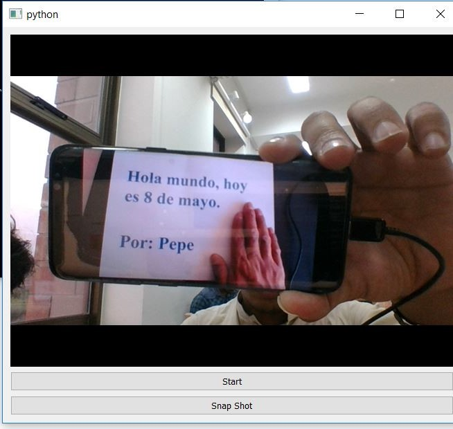

# Python-Application-for-Camera-OCR-then-text-to-speech
Python Application for to capture image using Camera then apply OCR to recognize the text,then text to speech audio. This program made for spanish language ocr and spanish language text to speech. With little change in language in code you can run on other languages.

- Download Anaconda3 latest version
- Download Tesseract OCR from this link windows 10 x64(https://digi.bib.uni-mannheim.de/tesseract/tesseract-ocr-w64-setup-v4.1.0.20190314.exe)

      > Install additional languages spa during installation.
      > Add the Tesseract directory in the code if directory of installation is change from default: C:\Program Files\Tesseract-OCR

- Open The Anaconda prompt and install these libraries
    
      > Python 			(Tested Version:3.6.5)    
      > cv2				(Tested Version:3.4.3)
      > PyQt5				(Default)
      > PIL				(Tested Version:5.1.0)
      > pytesseract			(Default pip installation)
      > gtts				(Tested Version:2.0.3)

- Run the code using anaconda prompt by changing the directory to where the code file is placed
	  
      > Anaconda Prompt: python ocr_text_to_speech.py

- Click on the Start to Start the camera.

- Click on the Snap Shot button to take picture for ocr to speech conversion.
    
      > Check the Anaconda Prompt for details about Text Found
      > Only do the speech if visible text found in the picture.

